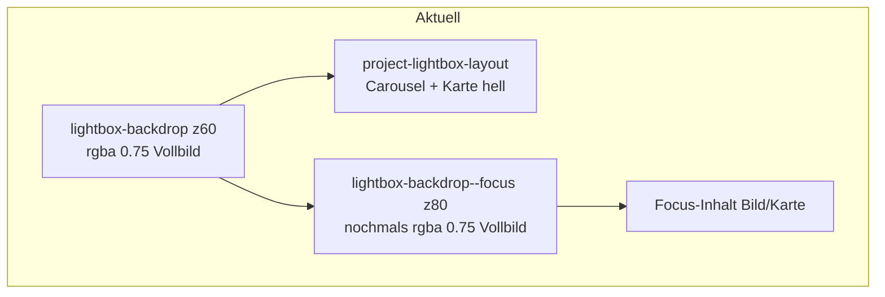
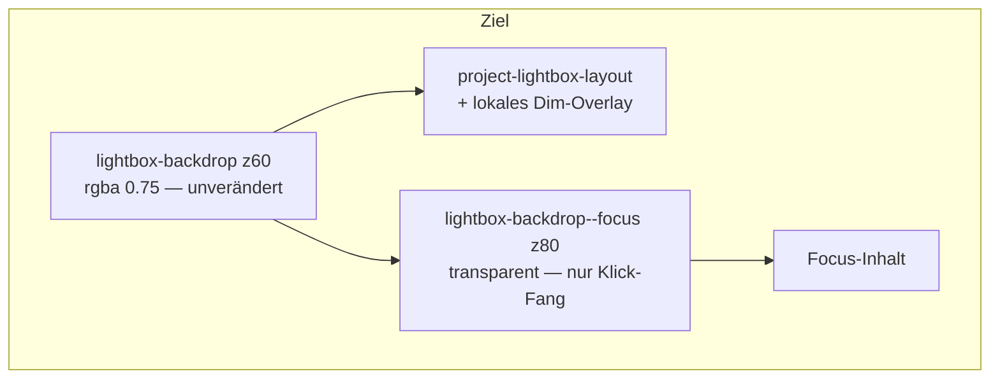

# Focus-Overlay: lokales Dimmen, Selektion, Bild-Ecken, Grösse

## Ausgangslage



- [`ProjectFocusOverlay.jsx`](app/components/ProjectFocusOverlay.jsx) nutzt `.lightbox-backdrop--focus`, erbt aber über `.lightbox-backdrop.is-active` ein **zweites** `background: rgba(0,0,0,0.75)` — der bereits dunkle Rand wird unnötig noch dunkler.
- Schnelles Doppel-Klicken auf den Backdrop (Focus schliessen → Projekt schliessen) markiert die Popup-Shell blau, weil `user-select: none` nur auf Pan-Frames gesetzt ist ([`globals.css`](app/globals.css) ~537–544).
- `.project-focus-image` hat `border-radius: 1rem` (~430) — im Bild-Focus werden Ecken abgeschnitten; gewünscht ist das **volle Bild mit scharfen Ecken**. Karten-Focus behält `border-radius: 1rem` auf `.project-lightbox-panel--centered`.
- **Focus-Overlay zu klein** auf manchen Viewports: wahrscheinliche Ursachen:
  - [`ProjectFocusOverlay`](app/components/ProjectFocusOverlay.jsx) hängt **nested** im Projekt-Backdrop (nicht wie Profil-Lightbox am `body`) → `%`-Grössen und Flex können je nach Browser/Breakpoint falsch auflösen.
  - `.project-focus-dialog` hat nur `max-width/max-height: 100%`, kein festes Viewport-Box — das `<Image>` mit `width/height: auto` kann in Flex-Layouts schrumpfen (`flex-shrink: 1`; Next.js setzt zusätzlich `max-width: 100%` am ``).
  - Karten-Focus erbt `.project-lightbox-panel { width: 100% }` — kann in schmalem Flex-Kontext auf Spaltenbreite statt Viewport kollabieren.

## Zielverhalten



| Aktion | Ergebnis |
|--------|----------|
| Focus öffnet | Rand bleibt gleich dunkel; **nur** Carousel + Karte (+ Pfeile in der Zeile) werden abgedunkelt |
| Schnell 2× ausserhalb klicken | Keine blaue Shell-Markierung |
| Doppelklick auf Titel/Beschreibung/Links in der Karte | Text weiterhin selektierbar |
| Bild-Focus | Kein `border-radius` am Bild |
| Karten-Focus | Abgerundete Ecken wie bisher |
| Focus auf allen Viewports | Bild/Karte nutzen verfügbaren Platz (~92vw × 92vh), nicht Spaltenbreite |

---

## 1. Lokales Dimmen statt zweitem Vollbild-Backdrop

**CSS** in [`globals.css`](app/globals.css):

- `.lightbox-backdrop--focus` und `.lightbox-backdrop--focus.is-active` explizit auf `background: transparent` setzen (Override von Zeile ~373).
- `.project-lightbox-layout` bekommt `position: relative`.
- Neuer Zustand `.project-lightbox-layout.is-focus-dimmed::before`:
  - `position: absolute; inset: 0;`
  - `background: rgba(0, 0, 0, 0.55)` (Feintuning beim Testen)
  - `pointer-events: none; z-index: 70`
  - `opacity`-Transition 200ms (passend zu `FOCUS_OVERLAY_MS`)
- Klasse `.is-focus-dimmed-active` für Einblend-Animation (analog `is-active` beim Focus-Overlay).

**JS** in [`ProjectCard.jsx`](app/components/ProjectCard.jsx):

- Am `.project-lightbox-layout` Klassen setzen wenn `focusMode !== null`:
  - `is-focus-dimmed` solange Focus-Lebenszyklus läuft (inkl. Exit-Animation bis `onExited` / `clearFocusMode`)
  - `is-focus-dimmed-active` wenn `focusOpen === true` (Dim einblenden; beim Schliessen ausblenden)

Damit dimmt **beide Spalten** einheitlich (User-Wunsch), ohne den bereits verdunkelten Hintergrund erneut abzudunkeln.

---

## 2. Doppelklick-Selektion einschränken

**CSS** — Shell-Elemente nicht selektierbar:

```css
.lightbox-backdrop,
.project-lightbox-layout,
.project-lightbox-media,
.project-lightbox-panel-wrap,
.project-lightbox-panel,
.project-focus-dialog,
.profile-lightbox-dialog {
  user-select: none;
  -webkit-user-select: none;
}
```

**Text in Karten weiter selektierbar:**

```css
.project-lightbox-panel .project-content h3,
.project-lightbox-panel .project-content .project-desc,
.project-lightbox-panel .project-content a {
  user-select: text;
  -webkit-user-select: text;
}
```

Gilt für Projekt-Lightbox **und** Profil-Lightbox ([`ProfileImageLightbox.jsx`](app/components/ProfileImageLightbox.jsx)).

**Optionaler JS-Guard** (falls Chrome trotzdem markiert): `onDoubleClick={(e) => e.preventDefault()}` auf Backdrop und Layout in `ProjectCard.jsx` / `ProfileImageLightbox.jsx` — nur auf Shells, nicht auf `.project-content`.

---

## 3. Bild-Focus ohne abgerundete Ecken

**CSS** in [`globals.css`](app/globals.css):

- `.project-focus-image`: `border-radius: 0` (Zeile ~430 entfernen/überschreiben).
- `.project-focus-dialog`: kein `overflow: hidden` / kein Radius (Dialog selbst hat aktuell keinen Radius — beibehalten).
- `.project-lightbox-panel--centered` im Focus-Overlay: `border-radius: 1rem` **unverändert** lassen.

Keine Änderung an Carousel-Frames (die behalten ihre Ecken im ersten Popup).

---

## 4. Focus-Overlay-Grösse zuverlässig machen

**Portal** in [`ProjectFocusOverlay.jsx`](app/components/ProjectFocusOverlay.jsx):

- Overlay via `createPortal(..., document.body)` rendern (wie [`ProfileImageLightbox.jsx`](app/components/ProfileImageLightbox.jsx) — eigenständiger Viewport-Layer, nicht Kind von `.lightbox-backdrop`).
- In [`ProjectCard.jsx`](app/components/ProjectCard.jsx) bleibt die State-Logik gleich; nur Render-Ziel ändert sich.

**Explizite Bild-Dialog-Box** in [`globals.css`](app/globals.css):

```css
.project-focus-dialog {
  width: min(92vw, 1400px);
  height: min(92vh, 92dvh);
  flex-shrink: 0;
  position: relative;
}

.project-focus-image {
  width: 100% !important;
  height: 100% !important;
  max-width: none;
  max-height: none;
  object-fit: contain;
  flex-shrink: 0;
  border-radius: 0;
}
```

Alternative (falls `fill` sauberer): Dialog mit fester Box + `<Image fill sizes="92vw" style={{ objectFit: 'contain' }} />`.

**Karten-Focus Override**:

```css
.lightbox-backdrop--focus .project-lightbox-panel--centered {
  width: min(90vw, 640px);
  max-width: min(90vw, 640px);
  flex-shrink: 0;
}
```

Damit überschreibt der Focus-Modus das generische `width: 100%` von `.project-lightbox-panel`.

**Test-Viewports** (manuell):

- ~720px, ~900px, ~1100px, ~1440px Breite
- Hochformat-Screenshots (schmale Breite bei voller Höhe — darf nicht auf Carousel-Spaltenbreite kollabieren)
- Karten-Focus auf schmalen Desktop-Fenstern

---

## Betroffene Dateien

| Datei | Änderung |
|-------|----------|
| [`app/globals.css`](app/globals.css) | Transparenter Focus-Backdrop, Layout-Dim-Overlay, user-select, border-radius Bild, Focus-Sizing |
| [`app/components/ProjectCard.jsx`](app/components/ProjectCard.jsx) | `is-focus-dimmed` Klassen am Layout, optional `onDoubleClick` Guard |
| [`app/components/ProjectFocusOverlay.jsx`](app/components/ProjectFocusOverlay.jsx) | Portal zu `document.body`, ggf. `Image fill` |
| [`app/components/ProfileImageLightbox.jsx`](app/components/ProfileImageLightbox.jsx) | Optional `onDoubleClick` Guard (Profil-Popup gleiches Verhalten) |

[`ProjectFocusOverlay.jsx`](app/components/ProjectFocusOverlay.jsx) wird strukturell angepasst (Portal + Sizing), nicht nur CSS.

---

## Testplan

1. Projekt mit Bildern öffnen → Bild-Focus: Rand-Dunkelheit **gleich** wie ohne Focus; nur Carousel+Karte werden dunkler; Bild hat **scharfe Ecken**.
2. Karten-Focus: Panel behält abgerundete Ecken.
3. Schnell 2× ausserhalb klicken (Focus → Projekt schliessen): keine blaue Markierung auf Backdrop/Layout.
4. Doppelklick auf Projekt-Titel/Beschreibung in der Karte: Text selektierbar.
5. Doppelklick auf Carousel-Bild / leeren Backdrop: nichts selektiert.
6. Focus-Bild bei ~900px und ~1440px Viewport: deutlich grösser als Carousel-Spalte, nutzt ~92vw/92vh.
7. Karten-Focus bei schmalem Fenster: volle `min(90vw, 640px)` Breite, nicht schmal eingezogen.
8. `npm run build`
